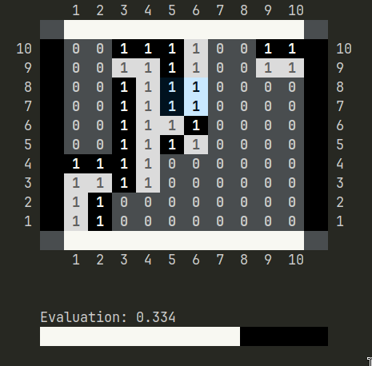

# Project 2 PFL - blinq 

## Group Members

### Group T02 Blinq_6

- Eduardo Castro Portugal Ferreira | up202206628 | 50%
- Xavier Dos Santos Portugal Martins | up202206632 | 50%

The evaluation logic was made together and all the other work was divided equally.

## Installation and Execution

- Guarantee that SICStus Prolog 4.9 is installed

- Download the project files

- Open a terminal and run this command to load the files

```bash
sicstus -l src/game.pl
```

- Execute this command to start the game

```bash
play.
```

## Description of the game

Blinq is a connection game for two players, where the main objective is to connect both sides of the player's color. To that, the game has dual coloured square blocks, that are the pieces used to connect the sides. This is a game where the players must be strategists, in order to complete their path, having in account questions like stacking and the other user thoughts.

There are some placement rules that must be considered:
    - Blocks must be parallel to the board lines
    - Blocks must be placed inside a cell
    - Blocks on top of other blocks must rest atop an arrangement of 2x2 blocks, and centred on it

The game ends in case of forfeit, or when a player connects, thw two sides of her colour. The game can also end in a draw in case of no more pieces left and connection is not completed.

[RuleBook Blinq](https://nestorgames.com/rulebooks/BLINQ_A5_EN.pdf)


## Considerations for game extensions

- Move selection mechanism (keyboard and precise position): players can flexibly choose the moves

- Immediate move validation: players can immediatly see wether the moves selected are valid or not

- Various board sizes 4x4 and 5x5

- Variable neutral piece position, with fast placement choice: for 5x5 board the neutral piece starting position can be chosen before the start of the game

- Different Bot difficulty levels: 3 levels of bot difficulty

- Live game evaluation bar, using a bold evaluation heuristic


## Game Logic

#### Disclaimer

Some predicates in this project do not strictly adhere to the specified structure. This approach was intentionally taken to enhance the overall organization and maintainability of the project, with the goal of ensuring its continued functionality in the future, as we aim to keep working on it.

The differences in structure are primarily related to code organization and are specific to this game. However, the functionality of all predicates as outlined in the project specification remains unchanged.

### Game Configuration Representation

The initial_state/3 predicate initializes the **GameState** based on the **GameConfig**, and stores a subset of **GameConfig** in **GameOptions** with the most important static aspect of the configuration.

- **GameConfig**: `[GameType, [Difficulty1, Difficulty2], BoardSize, NeutralBlock, Name1, Name2]` 
    - **GameType**: either PvP (Player vs Player), CvP (Computer (white pieces) vs Player), PvC (Player (white pieces) vs Computer) or CvC (computer vs Computer)
    - **[Difficulty1, Difficulty2]**: Difficulty levels for the bot players, 1 - easy, 2 - Medium, 3 - Hard
    - **BoardSize** : Either 4x4 or 5x5
    - **NeutralBlock**: Only considered for 5x5, with the value **[XPos, YPos]** representing the starting position of the neutral block
    - **Name1**: The name for the player with white pieces. Automatically given for bots.
    - **Name2**: The name for the player with black pieces. Automatically given for bots.


- **GameOptions**: `[GameType, [Difficulty1, Difficulty2], Name1, Name2]` 
  - Subset of **GameConfig** 

- **GameState**: `[Board, Player, BlocksLeft, ValidMoves, Selected]`
  - **Board**: Initial board game matrix, for the board size specified, containing the neutral piece in the specified for 5x5 boards
  - **Player**: The starting player, always as **white**
  - **BlocksLeft**: The total amount of blocks available for the chosen board (30 for 4x4 and 54 for 5x5)
  - **ValidMoves**: Initialized list with all the valid move position
  - **Selected**: The initial selected board square and orientation, initialized to the left bottom corner

### Internal Game State Representation

- **Current Board**: representation of all the board squares and their color and height
- **Player to play**: representative of the player to make the next move
- **BlocksLeft**: the total number of blocks remaining
- **Valid Moves List**: the list of all the current valid moves position
- **Selected**: the position and orientation currently selected


#### Initial State
```
[
[[[0,null],[0,null],[0,null],[0,null],[0,null],[0,null],[0,null],[0,null],[0,null],[0,null]],[[0,null],[0,null],[0,null],[0,null],[0,null],[0,null],[0,null],[0,null],[0,null],[0,null]],[[0,null],[0,null],[0,null],[0,null],[0,null],[0,null],[0,null],[0,null],[0,null],[0,null]],[[0,null],[0,null],[0,null],[0,null],[0,null],[0,null],[0,null],[0,null],[0,null],[0,null]],[[0,null],[0,null],[0,null],[0,null],[1,black],[1,white],[0,null],[0,null],[0,null],[0,null]],[[0,null],[0,null],[0,null],[0,null],[1,white],[1,black],[0,null],[0,null],[0,null],[0,null]],[[0,null],[0,null],[0,null],[0,null],[0,null],[0,null],[0,null],[0,null],[0,null],[0,null]],[[0,null],[0,null],[0,null],[0,null],[0,null],[0,null],[0,null],[0,null],[0,null],[0,null]],[[0,null],[0,null],[0,null],[0,null],[0,null],[0,null],[0,null],[0,null],[0,null],[0,null]],[[0,null],[0,null],[0,null],[0,null],[0,null],[0,null],[0,null],[0,null],[0,null],[0,null]]],
white,
54,
[[1,2],[1,4],[1,6],[1,8],[1,10],[3,2],[3,4],[3,6],[3,8],[3,10],[5,2],[5,4],[5,8],[5,10],[7,2],[7,4],[7,6],[7,8],[7,10],[9,2],[9,4],[9,6],[9,8],[9,10]],
[[1,2],1]
]

```


#### Intermediate State

```
[
[[[1,white],[1,black],[0,null],[0,null],[0,null],[0,null],[0,null],[0,null],[0,null],[0,null]],[[1,white],[1,black],[0,null],[0,null],[0,null],[0,null],[0,null],[0,null],[0,null],[0,null]],[[1,white],[1,white],[1,black],[1,white],[0,null],[0,null],[0,null],[0,null],[0,null],[0,null]],[[1,black],[1,black],[1,black],[1,white],[0,null],[0,null],[0,null],[0,null],[0,null],[0,null]],[[0,null],[0,null],[1,black],[1,white],[1,black],[1,white],[0,null],[0,null],[0,null],[0,null]],[[0,null],[0,null],[1,black],[1,white],[1,white],[1,black],[0,null],[0,null],[0,null],[0,null]],[[0,null],[0,null],[1,black],[1,white],[0,null],[0,null],[0,null],[0,null],[0,null],[0,null]],[[0,null],[0,null],[1,black],[1,white],[0,null],[0,null],[0,null],[0,null],[0,null],[0,null]],[[0,null],[0,null],[1,white],[1,white],[1,black],[1,white],[0,null],[0,null],[1,white],[1,white]],[[0,null],[0,null],[1,black],[1,black],[1,black],[1,white],[0,null],[0,null],[1,black],[1,black]]],
white,
46,
[[1,6],[1,8],[1,10],[3,2],[5,2],[5,4],[5,8],[7,2],[7,4],[7,6],[7,8],[7,10],[9,2],[9,4],[9,6],[9,8]],
[[5,8],3]
]
```


#### Final State

```
[
[[[1,white],[1,white],[1,white],[1,white],[1,black],[1,black],[0,null],[0,null],[0,nullack],[1,black],[2,white],[2,black],[1,white],[0,null],[0,null],[0,null],[0,null]],[[0,null],[0,null],[1,black],[2,white],[2,,null],[0,null],[0,null]],[[0,null],[0,null],[1,black],[2,white],[2,black],[1,black],[0,null],[0,null],[0,null],[0,null]],[[1[2,white],[2,black],[1,white],[0,null],[0,null],[0,null],[0,null]],[[1,white],[2,black],[2,white],[2,white],[2,white],[1,blac],[0,null]],[[1,black],[2,black],[2,white],[2,black],[2,black],[1,black],[1,black],[1,white],[1,white],[1,black]],[[1,white],],[2,white],[1,white],[1,black],[1,white],[1,white],[1,black]],[[1,white],[2,black],[2,black],[2,black],[2,white],[1,white],[,[1,black]],[[1,white],[1,black],[1,black],[1,black],[1,black],[1,black],[1,black],[1,white],[1,white],[1,black]]]],
black,
31,
[[7,6],[8,9],[9,2],[9,4],[9,6]],
[[2,9],4]
]
```


### Move Representation

The move is represented as follow: **[[XPos, YPos], Rotation]**

- **Position** **([XPos, YPos])**: represents where in the board the block should be positioned ( more exactly the top-left corner of the piece)
- **Rotation**: represent the rotation of the block (1 to 4)

The **move/3** predicate applies, if valid, a move to the board, returning the new game state, with all its information updated.


### User Interaction

The user is the most important part of the system so, we have tried to do clean and understandable menus.

The menus are stored in external text files in order to enable more prettier menus, through the use of ASCII ART. Also, the menus have a return back mechanism in order to give more use of freedom to the user. 

The input validation in the menus is done through the function **read_digit/3** that receives a min and max value in order to validate the input. On the other hand, the validation of specific positions and moves is done through the function **read_starting/3** and **read_position/7**, that guarantee that the input is inside the board and in a valid position

In the case of invalid inputs, the user is presented with an error message.


the capability
 n oroder f return back to the previously menu to givand 

## Conclusions

The development of this project was quite interest since it improved our Prolog knowledge and has shown his capabilities as a declarative logic-based language. At times, it was a bit confusing since we have to relot in recursion, backtracking and logical reasoning.

### Limitations

- Evaluation heuristic could be improved, evaluation bar can be misleading
- With the current minmax algorithm, even with pruning, dephts higher than 2 take too much time to calculate

### Future Improvements

- Develop a faster and better bot move calculation, with optimized algorithms

- Also use algorithms, like min-max, for the evaluation bar in order to increase its accuracy

- Improve visuals and system response time

- Improve evaluation heuristic, considering distance between paths and adjusting weights of each parameter. Calibrate path quality parameters score points

## Bibliography

[SICStus Prolog User's Manual](https://sicstus.sics.se/sicstus/docs/latest4/pdf/sicstus.pdf)

[SICStus Prolog Official Website](https://sicstus.sics.se/)

[The Amazing Course](https://sigarra.up.pt/feup/en/ucurr_geral.ficha_uc_view?pv_ocorrencia_id=484434)